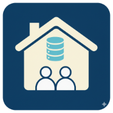

# Manual Penggunaan SIWarga v1.0.0



## 📖 Panduan Lengkap Penggunaan Sistem Informasi Warga

Selamat datang di **SIWarga**! Manual ini akan memandu Anda menggunakan semua fitur aplikasi dengan mudah dan efektif.

---

## 🚀 Memulai Aplikasi

### 1. Akses Aplikasi
- Buka browser (Chrome, Firefox, Safari, Edge)
- Kunjungi: **http://127.0.0.1:8000**
- Aplikasi akan menampilkan halaman login

### 2. Login Pertama Kali
**Kredensial Default:**
- **Email**: `admin@siwarga.local`
- **Password**: `password`

⚠️ **PENTING**: Segera ubah password default setelah login pertama!

### 3. Navigasi Utama
Setelah login, Anda akan melihat:
- **Header**: Logo, menu navigasi, profil pengguna
- **Sidebar**: Menu utama aplikasi
- **Content Area**: Area kerja utama
- **Footer**: Informasi versi dan status

---

## 🏠 Dashboard - Halaman Utama

### Fitur Dashboard
1. **Statistik Ringkas**
   - Total Kartu Keluarga
   - Total Anggota Keluarga  
   - Warga Musiman
   - Pengguna Aktif

2. **Grafik & Visualisasi**
   - Distribusi berdasarkan usia
   - Perbandingan jenis kelamin
   - Status pekerjaan
   - Tingkat pendidikan

3. **Aktivitas Terkini**
   - Data terbaru yang ditambahkan
   - Aktivitas pengguna
   - Notifikasi sistem

### Cara Menggunakan Dashboard
- **Klik pada statistik** untuk melihat detail
- **Hover pada grafik** untuk informasi spesifik
- **Gunakan filter tanggal** untuk periode tertentu

---

## 👨‍👩‍👧‍👦 Manajemen Kartu Keluarga

### Melihat Daftar Kartu Keluarga

1. **Akses Menu**
   - Klik **"Kartu Keluarga"** di sidebar
   - Atau gunakan shortcut **Ctrl+K**

2. **Fitur Pencarian**
   - **Pencarian cepat**: Ketik nomor KK atau nama KK
   - **Filter wilayah**: Pilih provinsi → kabupaten → kecamatan → desa
   - **Filter status**: Aktif, Non-aktif, Semua

3. **Tampilan Data**
   - **Tabel responsif** dengan kolom: No. KK, Nama KK, Alamat, Jumlah Anggota, Aksi
   - **Pagination** untuk navigasi data banyak
   - **Sorting** berdasarkan kolom (klik header tabel)

### Menambah Kartu Keluarga Baru

1. **Klik tombol "+ Tambah Kartu Keluarga"**

2. **Isi Form Data Utama:**
   ```
   📝 Data Wajib:
   - Nomor Kartu Keluarga (16 digit)
   - Nama Kepala Keluarga
   - Alamat Lengkap
   - RT/RW
   
   🌍 Data Wilayah:
   - Provinsi (pilih dari dropdown)
   - Kabupaten/Kota (otomatis muncul)
   - Kecamatan (otomatis muncul)  
   - Desa/Kelurahan (otomatis muncul)
   - Kode Pos
   ```

3. **Validasi Otomatis**
   - Sistem akan memvalidasi format nomor KK
   - Cek duplikasi nomor KK
   - Validasi kelengkapan data wilayah

4. **Simpan Data**
   - Klik **"Simpan"** untuk menyimpan
   - Klik **"Simpan & Tambah Anggota"** untuk langsung menambah anggota keluarga

### Mengedit Kartu Keluarga

1. **Dari daftar KK**, klik **ikon pensil** pada baris yang ingin diedit
2. **Update data** yang diperlukan
3. **Klik "Update"** untuk menyimpan perubahan

### Menghapus Kartu Keluarga

1. **Klik ikon tong sampah** pada baris KK
2. **Konfirmasi penghapusan** (data tidak dapat dikembalikan)
3. **Catatan**: KK yang memiliki anggota tidak dapat dihapus

⚠️ **PERINGATAN**: Penghapusan KK akan menghapus semua anggota keluarga di dalamnya!

---

## 👤 Manajemen Anggota Keluarga

### Melihat Daftar Anggota

1. **Akses Menu "Anggota Keluarga"**
2. **Filter berdasarkan:**
   - Kartu Keluarga tertentu
   - Usia (anak, dewasa, lansia)
   - Jenis kelamin
   - Status hubungan keluarga
   - Pekerjaan

### Menambah Anggota Keluarga

1. **Klik "+ Tambah Anggota"**

2. **Tab 1: Data Pribadi**
   ```
   👤 Identitas:
   - NIK (16 digit, unik)
   - Nama Lengkap
   - Jenis Kelamin
   - Tempat Lahir
   - Tanggal Lahir
   - Status Hubungan dalam Keluarga
   
   📞 Kontak:
   - Nomor Telepon/HP
   - Email (opsional)
   ```

3. **Tab 2: Data Sosial**
   ```
   🎓 Pendidikan:
   - Tingkat Pendidikan Terakhir
   - Status Sekolah (untuk usia sekolah)
   
   💼 Pekerjaan:
   - Jenis Pekerjaan
   - Status Pekerjaan (PNS, Swasta, Wiraswasta, dll)
   - Penghasilan per Bulan
   
   💒 Status Pernikahan:
   - Belum Menikah / Menikah / Cerai
   ```

4. **Tab 3: Data Kesehatan & BPJS**
   ```
   🏥 BPJS Kesehatan:
   - Status Kepesertaan (Ya/Tidak)
   - Jenis BPJS (PBI/Non-PBI)
   - Nomor Kartu BPJS
   
   👷 BPJS Ketenagakerjaan:
   - Status Kepesertaan
   - Nomor Kartu
   
   🩺 Data Kesehatan:
   - Golongan Darah
   - Riwayat Penyakit (opsional)
   - Disabilitas (jika ada)
   ```

5. **Validasi & Simpan**
   - Sistem akan memvalidasi NIK (format dan keunikan)
   - Validasi usia vs pendidikan
   - Simpan dengan klik **"Simpan"**

### Mengedit Data Anggota

1. **Klik nama anggota** atau **ikon edit**
2. **Gunakan tab navigation** untuk mengubah bagian tertentu
3. **Sistem akan mencatat perubahan** dengan timestamp
4. **Klik "Update"** untuk menyimpan

### Profil Detail Anggota

**Fitur Profil Lengkap:**
- **Foto profil** (upload optional)
- **Timeline aktivitas** perubahan data
- **Kartu digital** untuk print
- **QR Code** untuk identifikasi cepat
- **Riwayat perubahan data**

---

## 🏃‍♂️ Manajemen Warga Musiman

### Konsep Warga Musiman
Warga musiman adalah penduduk yang tinggal sementara di wilayah tertentu untuk:
- Bekerja musiman (pertanian, pariwisata)
- Kontrak kerja jangka pendek
- Pendidikan/kursus
- Keperluan keluarga

### Menambah Warga Musiman

1. **Menu "Warga Musiman" → "Tambah Baru"**

2. **Data Identitas**
   ```
   👤 Identitas Lengkap:
   - NIK
   - Nama Lengkap
   - Tempat/Tanggal Lahir
   - Jenis Kelamin
   - Agama
   ```

3. **Data Asal & Tujuan**
   ```
   🏠 Alamat Asal:
   - Provinsi asal
   - Kabupaten/Kota asal
   - Alamat lengkap asal
   
   📍 Alamat Sementara:
   - Alamat lengkap di lokasi saat ini
   - RT/RW tempat tinggal
   - Nama pemilik rumah (jika mengontrak)
   ```

4. **Data Perizinan**
   ```
   📅 Periode Tinggal:
   - Tanggal mulai tinggal
   - Rencana tanggal selesai
   - Perpanjangan (jika ada)
   
   📄 Dokumen:
   - Surat keterangan dari daerah asal
   - Kartu identitas
   - Surat pernyataan penjamin
   ```

5. **Data Pekerjaan/Keperluan**
   ```
   💼 Tujuan Tinggal:
   - Bekerja (sebutkan jenis pekerjaan)
   - Sekolah/Kuliah
   - Pengobatan
   - Keluarga
   - Lainnya (sebutkan)
   
   🏢 Detail Pekerjaan (jika bekerja):
   - Nama perusahaan/majikan
   - Alamat tempat kerja
   - Kontak person
   ```

### Monitoring Warga Musiman

1. **Dashboard Warga Musiman**
   - Jumlah warga masuk bulan ini
   - Warga yang akan habis masa tinggalnya
   - Distribusi berdasarkan asal daerah
   - Status perpanjangan izin

2. **Laporan Berkala**
   - Laporan bulanan untuk pemerintah
   - Export data ke Excel/PDF
   - Grafik tren kedatangan/kepulangan

### Update Status Warga Musiman

1. **Perpanjangan Izin**
   - Pilih warga dari daftar
   - Klik "Perpanjang Izin"
   - Isi tanggal perpanjangan
   - Upload dokumen pendukung

2. **Warga Pulang**
   - Tandai status "Sudah Pulang"
   - Isi tanggal kepulangan
   - Catatan khusus (jika ada)

---

## 👥 Manajemen Pengguna & Hak Akses

### Level Pengguna

#### 1. **Admin (Administrator)**
```
🔓 Hak Akses Penuh:
✅ Semua fitur CRUD (Create, Read, Update, Delete)
✅ Manajemen pengguna
✅ Backup & restore database
✅ Konfigurasi sistem
✅ Lihat semua log aktivitas
✅ Export semua data
```

#### 2. **Operator**
```
📝 Hak Akses Terbatas:
✅ CRUD Kartu Keluarga
✅ CRUD Anggota Keluarga  
✅ CRUD Warga Musiman
✅ Lihat dashboard & laporan
❌ Tidak bisa kelola pengguna
❌ Tidak bisa backup database
❌ Tidak bisa export data sensitif
```

#### 3. **Viewer (Penampil)**
```
👀 Hanya Baca:
✅ Lihat semua data (tanpa edit)
✅ Cari dan filter data
✅ Lihat dashboard
✅ Print laporan terbatas
❌ Tidak bisa tambah/edit/hapus data
❌ Tidak bisa export data
```

### Mengelola Pengguna (Admin Only)

1. **Menu "Manajemen" → "Pengguna"**

2. **Tambah Pengguna Baru**
   ```
   👤 Data Pengguna:
   - Nama Lengkap
   - Email (sebagai username)
   - Password (minimal 8 karakter)
   - Role (Admin/Operator/Viewer)
   - Status (Aktif/Non-aktif)
   ```

3. **Edit Pengguna**
   - Ubah informasi profil
   - Reset password
   - Ubah role/hak akses
   - Nonaktifkan pengguna

4. **Log Aktivitas Pengguna**
   - Lihat semua aktivitas per pengguna
   - Filter berdasarkan tanggal
   - Export log untuk audit

---

## 📊 Laporan & Export Data

### Jenis Laporan

#### 1. **Laporan Statistik Warga**
```
📈 Berisi:
- Distribusi usia (balita, anak, dewasa, lansia)
- Perbandingan jenis kelamin
- Tingkat pendidikan
- Jenis pekerjaan
- Status pernikahan
- Kepemilikan BPJS
```

#### 2. **Laporan Kartu Keluarga**
```
📋 Format Laporan:
- Daftar semua KK dengan anggotanya
- Berdasarkan wilayah (RT, RW, Desa)
- Per periode waktu
- Status aktif/non-aktif
```

#### 3. **Laporan Warga Musiman**
```
🏃‍♂️ Mencakup:
- Warga masuk dalam periode tertentu
- Warga keluar/pulang
- Perpanjangan izin
- Distribusi asal daerah
- Status pekerjaan
```

### Cara Generate Laporan

1. **Akses Menu "Laporan"**

2. **Pilih Jenis Laporan**
   - Klik jenis laporan yang diinginkan

3. **Set Parameter**
   ```
   📅 Filter Tanggal:
   - Dari tanggal
   - Sampai tanggal
   - Preset (7 hari, 30 hari, 90 hari, 1 tahun)
   
   🌍 Filter Wilayah:
   - Semua wilayah
   - Provinsi tertentu
   - Kabupaten tertentu
   - Kecamatan tertentu
   - Desa tertentu
   
   👥 Filter Demografis:
   - Semua usia
   - Kelompok usia tertentu
   - Jenis kelamin
   - Status pernikahan
   ```

4. **Preview & Generate**
   - Klik **"Preview"** untuk melihat data
   - Klik **"Generate"** untuk membuat laporan final

### Format Export

#### **PDF Format**
- Layout professional untuk print
- Header dengan logo dan info organisasi
- Tabel dengan formatting yang rapi
- Chart/grafik (jika ada)
- Footer dengan tanggal generate

#### **Excel Format**
- Data dalam format tabel
- Multiple sheets untuk data kompleks
- Formatting untuk kemudahan baca
- Formulas untuk perhitungan otomatis

#### **CSV Format**
- Data mentah untuk import ke sistem lain
- Separator koma standar
- Encoding UTF-8 untuk karakter Indonesia

### Cara Export Data

1. **Dari Laporan**
   - Setelah generate laporan
   - Klik **"Export PDF"** atau **"Export Excel"**
   - File akan didownload otomatis

2. **Export Bulk Data**
   - Menu **"Export"** → **"Export Semua Data"**
   - Pilih tabel yang ingin di-export
   - Pilih format (Excel/CSV)
   - Download file ZIP jika data besar

---

## 🔒 Keamanan & Backup

### Fitur Keamanan

#### 1. **Password Policy**
```
🔐 Aturan Password:
- Minimal 8 karakter
- Kombinasi huruf besar, kecil, angka
- Karakter khusus dianjurkan
- Tidak boleh sama dengan email
- Harus diganti setiap 90 hari (untuk admin)
```

#### 2. **Session Management**
```
⏰ Pengaturan Session:
- Timeout otomatis setelah 2 jam idle
- Logout otomatis saat browser ditutup
- Maximum 1 session per user
- Log semua aktivitas login/logout
```

#### 3. **Rate Limiting**
```
🚫 Pembatasan Akses:
- Maksimal 100 query per menit (user biasa)
- Maksimal 500 query per menit (admin)
- Block IP jika 5x gagal login berturut-turut
- Cooldown 15 menit untuk IP yang di-block
```

### Backup & Restore

#### **Backup Otomatis**
```
🔄 Jadwal Backup:
- Harian: Setiap hari jam 02:00
- Mingguan: Setiap Minggu jam 01:00  
- Bulanan: Tanggal 1 setiap bulan
- Retention: 30 hari terakhir
```

#### **Backup Manual**

1. **Menu "Sistem" → "Backup Database"**

2. **Pilih Jenis Backup**
   ```
   💾 Opsi Backup:
   - Full Backup (semua data)
   - Incremental (perubahan saja)
   - Table Specific (pilih tabel)
   ```

3. **Pengaturan Backup**
   ```
   🔐 Opsi Keamanan:
   - Enkripsi dengan password
   - Kompresi untuk menghemat space
   - Verifikasi integritas data
   ```

4. **Eksekusi Backup**
   - Klik **"Mulai Backup"**
   - Progress bar akan muncul
   - File backup tersimpan di folder backup
   - Notifikasi email (jika diatur)

#### **Restore Database**

⚠️ **HANYA UNTUK ADMIN** ⚠️

1. **Menu "Sistem" → "Restore Database"**

2. **Pilih File Backup**
   - Upload file backup (.sql atau .zip)
   - Atau pilih dari backup yang tersimpan

3. **Verifikasi & Restore**
   ```
   ✅ Validasi:
   - Cek integritas file
   - Verifikasi password (jika terenkripsi)
   - Preview data yang akan di-restore
   
   🔄 Proses Restore:
   - Backup data current terlebih dahulu
   - Restore data dari file
   - Verifikasi hasil restore
   ```

---

## 🔧 Pengaturan Sistem

### Konfigurasi Aplikasi

#### **Informasi Organisasi**
```
🏢 Data Organisasi:
- Nama Organisasi/Instansi
- Alamat Lengkap
- Kontak (Telepon, Email, Website)
- Logo Organisasi
- Kepala Daerah/Pimpinan
```

#### **Pengaturan Regional**
```
🌍 Wilayah Default:
- Provinsi default
- Kabupaten/Kota default
- Setting untuk data baru
- Zona waktu
```

#### **Notifikasi**
```
📧 Email Settings:
- SMTP Server
- Email pengirim
- Template email notifikasi
- Auto-notification untuk backup

🔔 Push Notifications:
- Notifikasi browser
- Alert untuk data penting
- Reminder untuk update data
```

### Maintenance Mode

**Aktivasi Maintenance:**
1. Menu **"Sistem" → "Maintenance"**
2. Klik **"Aktifkan Mode Maintenance"**
3. Isi pesan untuk pengguna
4. Set estimasi waktu selesai

**Selama Maintenance:**
- Hanya admin yang bisa akses
- User lain akan melihat halaman maintenance
- Sistem tetap melakukan backup otomatis

---

## 📱 Fitur Mobile & PWA

### Progressive Web App (PWA)

**Instalasi di Mobile:**
1. Buka aplikasi di browser mobile
2. Tap menu browser → **"Add to Home Screen"**
3. Icon SIWarga akan muncul di home screen
4. Buka seperti aplikasi native

**Fitur PWA:**
- ✅ **Offline reading** untuk data yang sudah dimuat
- ✅ **Push notifications** untuk update penting
- ✅ **Fast loading** dengan caching
- ✅ **Responsive design** untuk semua screen size

### Mobile-Optimized Features

#### **Navigasi Mobile**
- **Bottom navigation** untuk akses cepat
- **Swipe gestures** untuk navigasi
- **Touch-friendly buttons** minimum 44px
- **Auto-zoom prevention** untuk form input

#### **Form Mobile**
- **Auto-suggest** untuk input data
- **Date picker** native mobile
- **Camera access** untuk upload foto
- **Barcode scanner** untuk input NIK (jika support)

#### **Search Mobile**
- **Voice search** untuk pencarian cepat
- **Recent searches** history
- **Filter chips** untuk filter cepat
- **Infinite scroll** untuk hasil banyak

---

## 🚨 Troubleshooting & FAQ

### Masalah Umum

#### **Tidak Bisa Login**
```
🔍 Solusi:
1. Cek caps lock dan ejaan email/password
2. Clear browser cache dan cookies
3. Coba browser lain (Chrome, Firefox)
4. Hubungi admin untuk reset password
5. Cek koneksi internet
```

#### **Data Tidak Muncul**
```
🔍 Solusi:
1. Refresh halaman (F5 atau Ctrl+R)
2. Cek filter yang aktif
3. Cek hak akses role anda
4. Clear browser cache
5. Logout dan login kembali
```

#### **Upload Gagal**
```
🔍 Solusi:
1. Cek ukuran file (max 5MB)
2. Cek format file (JPG, PNG, PDF)
3. Cek koneksi internet
4. Rename file (hindari karakter khusus)
5. Compress file jika terlalu besar
```

#### **Laporan Tidak Generate**
```
🔍 Solusi:
1. Cek filter tanggal (jangan terlalu lama)
2. Cek data yang di-filter (mungkin kosong)
3. Tunggu beberapa saat (data besar butuh waktu)
4. Coba export format lain (PDF → Excel)
5. Hubungi admin jika tetap bermasalah
```

### FAQ (Frequently Asked Questions)

#### **Q: Bagaimana cara mengubah password?**
A: Klik foto profil → Settings → Security → Change Password

#### **Q: Bisakah mengedit data yang sudah disimpan?**
A: Ya, klik ikon edit (pensil) pada data yang ingin diubah. Semua perubahan akan dicatat dalam log.

#### **Q: Bagaimana cara mencari data dengan cepat?**
A: Gunakan search box di bagian atas tabel, atau gunakan filter berdasarkan kategori tertentu.

#### **Q: Apakah data aman dari kehilangan?**
A: Ya, sistem melakukan backup otomatis harian dan menyimpan data dengan enkripsi tingkat enterprise.

#### **Q: Bisakah mengakses dari HP?**
A: Ya, aplikasi fully responsive dan bisa diinstall sebagai PWA di smartphone.

#### **Q: Bagaimana cara print kartu keluarga?**
A: Buka detail KK → klik "Print" → pilih format → print atau save PDF.

#### **Q: Data warga musiman otomatis terhapus?**
A: Tidak, data tersimpan permanen. Admin bisa update status menjadi "Sudah Pulang" saat warga kembali ke daerah asal.

#### **Q: Bisakah import data dari Excel?**
A: Fitur import sedang dalam pengembangan untuk versi selanjutnya.

---

## 📞 Bantuan & Support

### Kontak Support

```
📧 Email Developer: sutiyonodoang@gmail.com
📧 Email Support: support@siwarga.local
📞 Telepon: 
🕒 Jam Kerja: Senin-Jumat, 08:00-17:00 WIB
💬 Live Chat: Available dalam aplikasi (pojok kanan bawah)
```

### Pelatihan & Workshop

**Pelatihan Online:**
- Tutorial video lengkap di YouTube channel
- Webinar bulanan untuk fitur baru
- Q&A session dengan developer

**Pelatihan Offline:**
- Workshop setup untuk organisasi baru
- Training admin dan operator
- Konsultasi implementasi

### Update & Release Notes

**Cara Cek Update:**
1. Menu **"Bantuan" → "Tentang"**
2. Lihat versi saat ini
3. Klik **"Cek Update"** untuk versi terbaru

**Subscribe Newsletter:**
- Info update fitur terbaru
- Tips penggunaan aplikasi
- Best practices dari pengguna lain

---

## 📚 Lampiran

### Shortcut Keyboard

```
⌨️ Navigasi Cepat:
Ctrl + D     = Dashboard
Ctrl + K     = Kartu Keluarga  
Ctrl + A     = Anggota Keluarga
Ctrl + M     = Warga Musiman
Ctrl + R     = Laporan
Ctrl + S     = Simpan form
Ctrl + /     = Search/Pencarian
ESC          = Tutup modal/dialog
```

### Template & Format

#### **Template NIK Validation**
```
Format NIK: XX.XXXX.DDMMYY.XXXX
- 2 digit: Kode Provinsi
- 4 digit: Kode Kabupaten/Kota
- 6 digit: Tanggal lahir (DDMMYY)
- 4 digit: Nomor urut
```

#### **Template Nomor KK**
```
Format KK: PPKKDD.DDMMYY.XXXX
- PP: Kode Provinsi
- KK: Kode Kabupaten
- DD: Kode Kecamatan  
- DDMMYY: Tanggal terbit
- XXXX: Nomor urut
```

### Panduan Print & Export

#### **Setting Print Optimal**
```
📄 Pengaturan Print:
- Paper: A4 Portrait
- Margin: Normal (2.54cm)
- Scale: 100%
- Background graphics: On
- Headers/Footers: Off
```

#### **Template Surat**
- **Surat Keterangan Domisili**
- **Surat Keterangan KK**
- **Surat Keterangan Warga Musiman**
- **Laporan Statistik Bulanan**

---

**Selamat menggunakan SIWarga v1.0.0!**

Semoga aplikasi ini membantu digitalisasi administrasi kependudukan di wilayah Anda. 

Untuk bantuan lebih lanjut, jangan ragu menghubungi tim support kami.

---

*Manual ini berlaku untuk SIWarga versi 1.0.0*  
*Update: September 2025*  
*Copyright © 2025 Sutiyono (sutiyonodoang@gmail.com)*
