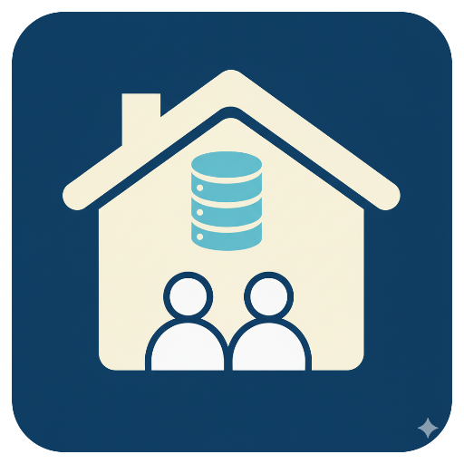

# SIWarga - Sistem Informasi Warga

<div align="center">
  
  
  **Sistem Informasi Warga Digital untuk Indonesia** 🇮🇩
  
  [](https://github.com/sutiyonodoang/siwarga-app/releases/tag/v1.0.0)
  [](LICENSE)
  [](https://laravel.com)
  [](https://reactjs.org)
  [](https://www.typescriptlang.org)
</div>

---

## 📋 Tentang SIWarga

**SIWarga** adalah aplikasi web modern untuk mengelola data kependudukan dan administrasi warga secara digital. Dirancang khusus untuk pemerintah daerah, RT/RW, dan organisasi kemasyarakatan di Indonesia.

### ✨ Fitur Utama
- 👥 **Manajemen Kartu Keluarga** - Input dan kelola data KK dengan validasi NIK
- 👤 **Data Anggota Keluarga** - Profil lengkap warga dengan data sosial ekonomi
- 🌍 **Database Regional Indonesia** - 37 provinsi, 514 kabupaten, 7.277 kecamatan, 83.761 desa
- 🔐 **Keamanan Enterprise** - Enkripsi database, rate limiting, audit trail
- 📊 **Dashboard Analytics** - Statistik real-time dan laporan komprehensif
- 📱 **Progressive Web App** - Akses mobile-friendly dengan offline support
- 🔄 **Backup Otomatis** - Sistem backup terenkripsi dengan retention policy

### 🛠️ Teknologi
- **Backend**: Laravel 12.25.0 + PHP 8.2+
- **Frontend**: React 19.0 + TypeScript 5.7
- **Database**: SQLite dengan WAL mode dan enkripsi
- **UI/UX**: Radix UI + Tailwind CSS 4.0
- **Build**: Vite 7.1 dengan Hot Module Replacement

---

## 📚 Dokumentasi Lengkap

### 🚀 **Memulai**
| Dokumen | Deskripsi | Target |
|---------|-----------|---------|
| **[📖 Manual Penggunaan](MANUAL.md)** | Panduan lengkap cara menggunakan aplikasi | Pengguna akhir, Admin |
| **[⚙️ Panduan Instalasi](INSTALL.md)** | Setup development hingga production deployment | Developer, System Admin |

### 🔧 **Developer**
| Dokumen | Deskripsi | Target |
|---------|-----------|---------|
| **[🔌 API Documentation](API.md)** | REST API endpoints, authentication, SDK examples | Developer, Integrator |
| **[🤝 Contributing Guide](CONTRIBUTING.md)** | Guidelines untuk kontribusi code dan development | Contributor, Developer |

### 📋 **Project Info**
| Dokumen | Deskripsi | Target |
|---------|-----------|---------|
| **[🔒 Security Policy](SECURITY.md)** | Kebijakan keamanan, vulnerability reporting | Security Team, Admin |
| **[📝 Changelog](CHANGELOG.md)** | Riwayat versi dan release notes | Semua stakeholder |
| **[⚖️ License](LICENSE)** | MIT License dan informasi legal | Legal, Compliance |

---

## ⚡ Quick Start

### 1️⃣ **Clone Repository**
```bash
git clone https://github.com/sutiyonodoang/siwarga-app.git
cd siwarga-app
```

### 2️⃣ **Install Dependencies**
```bash
composer install
npm install
```

### 3️⃣ **Setup Environment**
```bash
cp .env.example .env
php artisan key:generate
php artisan migrate --seed
```

### 4️⃣ **Start Development**
```bash
npm run build
php artisan serve
```

### 5️⃣ **Access Application**
- **URL**: http://127.0.0.1:8000
- **Login**: admin@siwarga.local / password

> 📖 **Detail instalasi**: Lihat [INSTALL.md](INSTALL.md) untuk panduan lengkap

---

## 📊 Status Aplikasi

### ✅ **Production Ready**
- ✅ 28 database migrations completed
- ✅ Complete Indonesian regional database
- ✅ Enterprise-level security implemented
- ✅ Comprehensive test suite
- ✅ Production deployment ready
- ✅ Documentation complete

### 📈 **Statistics**
- **Database**: 83.761 villages, 7.277 districts, 514 regencies, 37 provinces
- **Migrations**: 28 successful migrations
- **Security**: Rate limiting, encryption, audit logging
- **Performance**: Optimized queries, asset bundling, caching
- **Documentation**: 45.000+ words across 7 documents

---

## 🎯 Use Cases

### 🏛️ **Pemerintah Daerah**
- Digitalisasi data kependudukan
- Monitoring demografis wilayah
- Pelaporan statistik penduduk
- Validasi data NIK dan KK

### 🏘️ **RT/RW**
- Manajemen data warga
- Pencatatan warga musiman
- Laporan bulanan/tahunan
- Koordinasi dengan kelurahan

### 🏢 **Organisasi**
- Database membership
- Tracking data sosial ekonomi
- Analytics dan reporting
- Management multi-role

---

## 🤝 Kontribusi

Kami menerima kontribusi dari komunitas! Silakan baca [CONTRIBUTING.md](CONTRIBUTING.md) untuk:

- 🔧 **Development setup**
- 📝 **Coding standards**
- 🧪 **Testing guidelines**
- 📋 **Pull request process**

### 🐛 **Melaporkan Bug**
- Buka [GitHub Issues](https://github.com/sutiyonodoang/siwarga-app/issues)
- Gunakan template bug report
- Sertakan environment details

### 💡 **Request Feature**
- Diskusi di [GitHub Discussions](https://github.com/sutiyonodoang/siwarga-app/discussions)
- Buat proposal feature
- Tunggu feedback komunitas

---

## 🔒 Keamanan

### 🛡️ **Security Features**
- **Database Encryption**: AES-256 encryption untuk data sensitif
- **Rate Limiting**: Perlindungan terhadap abuse dan DoS
- **Audit Trail**: Logging semua aktivitas pengguna
- **Access Control**: Role-based permissions (Admin, Operator, Viewer)
- **CSRF Protection**: Laravel CSRF token validation
- **SQL Injection Prevention**: Eloquent ORM prepared statements

### 🚨 **Melaporkan Vulnerability**
Jika Anda menemukan kerentanan keamanan:

1. **Jangan** buat issue public
2. **Email**: sutiyonodoang@gmail.com dengan subject "[SECURITY]"
3. **Include**: Detail vulnerability dan impact assessment
4. **Response time**: 24-48 jam

> 🔒 **Detail security**: Lihat [SECURITY.md](SECURITY.md) untuk policy lengkap

---

## 📞 Support & Community

### 💬 **Get Help**
- **📖 Documentation**: Mulai dari [MANUAL.md](MANUAL.md)
- **❓ Questions**: [GitHub Discussions](https://github.com/sutiyonodoang/siwarga-app/discussions)
- **🐛 Issues**: [GitHub Issues](https://github.com/sutiyonodoang/siwarga-app/issues)
- **📧 Direct**: sutiyonodoang@gmail.com

### 🌟 **Community**
- **Stars**: Jika aplikasi ini membantu, berikan ⭐ di GitHub
- **Fork**: Fork repository untuk development sendiri
- **Share**: Bagikan ke komunitas yang membutuhkan
- **Contribute**: Join sebagai contributor

---

## 📄 License & Copyright

**MIT License** - see [LICENSE](LICENSE) file for details.

**Copyright © 2025 Sutiyono**  
**Email**: sutiyonodoang@gmail.com  
**GitHub**: [@sutiyonodoang](https://github.com/sutiyonodoang)

---

## 🏆 Acknowledgments

### 🙏 **Special Thanks**
- **Indonesian Government** - untuk data wilayah administratif
- **Laravel Community** - framework yang powerful dan elegant
- **React Community** - library yang revolutioner
- **Open Source Community** - semua package dan tools yang digunakan

### 🎨 **Built With Love**
Dibuat dengan ❤️ untuk kemajuan digitalisasi administrasi kependudukan Indonesia.

---

<div align="center">
  
  ### 🚀 **Ready to Start?**
  
  **[📖 Baca Manual](MANUAL.md)** • **[⚙️ Install Guide](INSTALL.md)** • **[🔌 API Docs](API.md)**
  
  ---
  
  **SIWarga v1.0.0** - *Sistem Informasi Warga Digital untuk Indonesia* 🇮🇩
  
</div>