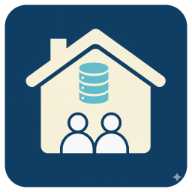

# User Manual - SIWarga v1.0.0



## 📖 Complete Guide to Citizen Information System

Welcome to **SIWarga**! This manual will guide you through using all application features easily and effectively.

---

## 🚀 Getting Started

### 1. Accessing the Application
- Open your browser (Chrome, Firefox, Safari, Edge)
- Visit: **http://127.0.0.1:8000**
- The application will display the login page

### 2. First Login
**Default Credentials:**
- **Email**: `admin@siwarga.local`
- **Password**: `password`

⚠️ **IMPORTANT**: Change the default password immediately after first login!

### 3. Main Navigation
After login, you will see:
- **Header**: Logo, navigation menu, user profile
- **Sidebar**: Main application menu
- **Content Area**: Main working area
- **Footer**: Version information and status

---

## 🏠 Dashboard - Main Page

### Dashboard Features
1. **Summary Statistics**
   - Total Family Cards
   - Total Family Members
   - Seasonal Residents
   - Active Users

2. **Charts & Visualizations**
   - Age distribution
   - Gender comparison
   - Employment status
   - Education levels

3. **Recent Activities**
   - Latest added data
   - User activities
   - System notifications

### Using the Dashboard
- **Click on statistics** to view details
- **Hover on charts** for specific information
- **Use date filters** for specific periods

---

## 👨‍👩‍👧‍👦 Family Card Management

### Viewing Family Card List

1. **Access Menu**
   - Click **"Family Cards"** in sidebar
   - Or use shortcut **Ctrl+K**

2. **Search Features**
   - **Quick search**: Type family card number or head name
   - **Regional filter**: Select province → regency → district → village
   - **Status filter**: Active, Inactive, All

3. **Data Display**
   - **Responsive table** with columns: Card No., Head Name, Address, Member Count, Actions
   - **Pagination** for navigating large data sets
   - **Sorting** by column (click table header)

### Adding New Family Card

1. **Click "+ Add Family Card" button**

2. **Fill Main Data Form:**
   ```
   📝 Required Data:
   - Family Card Number (16 digits)
   - Head of Family Name
   - Complete Address
   - RT/RW
   
   🌍 Regional Data:
   - Province (select from dropdown)
   - Regency/City (automatically appears)
   - District (automatically appears)
   - Village (automatically appears)
   - Postal Code
   ```

3. **Automatic Validation**
   - System validates family card number format
   - Checks for duplicate family card numbers
   - Validates required fields
   - Regional data integration

4. **Save Data**
   - Click **"Save"** button
   - System displays success confirmation
   - Redirect to family card detail page

### Editing Family Card

1. **From family card list**, click **"Edit"** button
2. **Modify required data** in the form
3. **Save changes** - system validates updates
4. **View updated data** in detail page

### Family Card Details

**Detail page displays:**
- Complete family card information
- List of all family members
- Quick actions (add member, edit, delete)
- Activity history
- Print/export options

---

## 👤 Family Member Management

### Viewing Family Member List

1. **Access via two methods:**
   - **Sidebar menu**: Click "Family Members"
   - **From family card**: Click "View Members"

2. **Advanced Search Features:**
   ```
   🔍 Search Options:
   - By name or NIK (National ID)
   - By family card
   - By gender (Male/Female)
   - By marital status
   - By age range
   - By employment status
   ```

3. **Data Filtering:**
   - **Regional filter**: Province, regency, district, village
   - **Social filter**: Education, employment, BPJS status
   - **Status filter**: Active, inactive, seasonal

### Adding New Family Member

1. **Click "+ Add Family Member" button**

2. **Select Family Card:**
   - Choose existing family card
   - Or create new family card simultaneously

3. **Fill Personal Data:**
   ```
   📋 Identity Information:
   - NIK (National ID Number) - 16 digits
   - Full Name
   - Gender (Male/Female)
   - Place of Birth
   - Date of Birth
   - Religion
   - Nationality (Indonesian/Foreign)
   
   👨‍👩‍👧‍👦 Family Information:
   - Family Status (Head, Wife, Child, etc.)
   - Father's Name
   - Mother's Name
   - Marital Status
   ```

4. **Social Economic Data:**
   ```
   🎓 Education & Employment:
   - Education Level
   - Employment Status
   - Occupation
   - Monthly Income
   
   🏥 Health Insurance:
   - BPJS Health Status
   - BPJS Employment Status
   - Health Insurance Details
   
   📍 Additional Information:
   - Disability Status
   - Special Needs
   - Notes
   ```

5. **Data Validation:**
   - NIK format validation (16 digits)
   - Age calculation from birth date
   - Family relationship validation
   - Duplicate NIK checking

### Member Profile Management

**Complete profile includes:**
- **Personal identity** with photo
- **Family relationships** and genealogy
- **Educational background** and achievements
- **Employment history** and current status
- **Health information** and insurance
- **Social economic status** indicators

### Seasonal Resident Management

1. **Special Features for Seasonal Residents:**
   - **Temporary registration** with time limits
   - **Origin and destination** address tracking
   - **Stay permit status** monitoring
   - **Periodic reporting** requirements

2. **Data Fields:**
   ```
   📍 Residence Information:
   - Original address (hometown)
   - Current temporary address
   - Expected stay duration
   - Reason for temporary residence
   - Local sponsor/contact
   ```

---

## 🔐 User Management & Access Rights

### User Role System

**SIWarga uses 3-level access control:**

1. **👑 Administrator**
   - **Full access** to all features
   - **User management** (create, edit, delete users)
   - **System settings** configuration
   - **Data export/import** capabilities
   - **Audit log** access
   - **Backup/restore** functions

2. **👨‍💼 Operator**
   - **Data entry** and editing (family cards, members)
   - **View reports** and statistics
   - **Limited user management** (view only)
   - **Export data** in standard formats
   - **Basic system functions**

3. **👁️ Viewer**
   - **Read-only access** to data
   - **View reports** and statistics
   - **Search and filter** capabilities
   - **No editing** or administrative functions

### Managing Users

**Administrators can:**
1. **Create new users** with appropriate roles
2. **Edit user information** and permissions
3. **Activate/deactivate** user accounts
4. **Reset passwords** for users
5. **Monitor user activity** through audit logs

### Account Security

**Security features:**
- **Strong password** requirements (minimum 8 characters)
- **Session timeout** after inactivity
- **Failed login** attempt tracking
- **Account lockout** after multiple failed attempts
- **Activity logging** for all user actions

---

## 📊 Reports & Analytics

### Dashboard Analytics

**Real-time statistics:**
- **Population count** by category
- **Gender distribution** charts
- **Age group** analysis
- **Educational level** statistics
- **Employment status** breakdown
- **Regional distribution** maps

### Standard Reports

1. **Population Reports:**
   - **By age group** (children, adults, elderly)
   - **By gender** and marital status
   - **By education** and employment
   - **By regional** distribution

2. **Family Reports:**
   - **Family size** distribution
   - **Head of family** demographics
   - **Family composition** analysis
   - **Socio-economic** indicators

3. **Administrative Reports:**
   - **Data entry** statistics
   - **User activity** summaries
   - **System usage** analytics
   - **Data quality** reports

### Custom Reports

**Report generation features:**
- **Date range** selection
- **Regional filtering** (province to village level)
- **Demographic filtering** (age, gender, status)
- **Export formats** (PDF, Excel, CSV)
- **Scheduled reports** via email

### Data Export

**Export options:**
1. **Excel format** - for data analysis
2. **PDF format** - for official reports
3. **CSV format** - for data integration
4. **Print preview** - for hard copy reports

---

## 📱 Mobile & PWA Features

### Progressive Web App (PWA)

**SIWarga can be installed as mobile app:**
1. **Open in mobile browser** (Chrome, Safari)
2. **Add to home screen** when prompted
3. **Works offline** for basic viewing
4. **Automatic updates** when online
5. **Native app experience** on mobile devices

### Mobile Responsive Design

**Optimized for all screen sizes:**
- **Phone** (320px - 768px): Simplified navigation, touch-friendly buttons
- **Tablet** (768px - 1024px): Adaptive layout, optimized forms
- **Desktop** (1024px+): Full feature access, multi-column layout

### Offline Capabilities

**Available offline:**
- **View cached data** from last sync
- **Basic search** in cached records
- **Form preparation** (save drafts)
- **Photo capture** for later upload
- **Automatic sync** when connection restored

---

## 🔧 System Administration

### Database Management

**For administrators:**
1. **Automatic backups** - daily encrypted backups
2. **Manual backup** - on-demand backup creation
3. **Data restoration** - from backup files
4. **Database optimization** - performance tuning
5. **Data integrity** - consistency checks

### System Configuration

**Configurable settings:**
- **Organization information** (name, logo, contact)
- **Regional data** updates
- **User access** policies
- **Backup settings** and retention
- **Security parameters** and rate limits

### Maintenance Mode

**System maintenance features:**
- **Scheduled maintenance** with user notification
- **Emergency maintenance** for critical updates
- **Data migration** tools
- **Version updates** with rollback capability

---

## 🚨 Troubleshooting

### Common Issues

#### 1. **Login Problems**
```
Problem: Cannot login with correct credentials
Solution:
- Clear browser cache and cookies
- Check if account is active
- Verify password (case-sensitive)
- Contact administrator for password reset
```

#### 2. **Data Not Saving**
```
Problem: Form data not saving properly
Solution:
- Check internet connection
- Verify all required fields are filled
- Check file size limits for uploads
- Refresh page and try again
```

#### 3. **Search Not Working**
```
Problem: Search returns no results
Solution:
- Check search terms (spelling, format)
- Try broader search criteria
- Clear search filters
- Refresh page and search again
```

#### 4. **Slow Performance**
```
Problem: Application loading slowly
Solution:
- Check internet connection speed
- Clear browser cache
- Close other browser tabs
- Contact administrator if problem persists
```

### Error Messages

**Common error messages and solutions:**

| Error | Meaning | Solution |
|-------|---------|----------|
| "Session Expired" | Login session timed out | Login again |
| "Permission Denied" | Insufficient access rights | Contact administrator |
| "Validation Failed" | Form data invalid | Check required fields |
| "Network Error" | Connection problem | Check internet connection |
| "Server Error" | System problem | Contact technical support |

### Getting Help

**Support channels:**
1. **User Manual** - comprehensive guide (this document)
2. **System Administrator** - for technical issues
3. **Help Desk** - for user support
4. **Email Support** - sutiyonodoang@gmail.com
5. **Documentation** - online help resources

### Contact Information

**For technical support:**
- **Developer**: Sutiyono
- **Email**: sutiyonodoang@gmail.com
- **Response Time**: 24-48 hours
- **Emergency Support**: Available for critical issues

---

## 📄 Legal & Compliance

### Data Privacy

**SIWarga handles sensitive personal data:**
- **Data encryption** for storage and transmission
- **Access controls** limit data access
- **Audit trails** track all data access
- **Regular backups** ensure data availability
- **Secure deletion** for obsolete data

### Compliance

**Regulatory compliance:**
- **Indonesian data protection** regulations
- **Government audit** requirements
- **Security standards** implementation
- **Privacy policy** compliance

---

## 🎓 Best Practices

### Data Entry Guidelines

1. **Accuracy First**
   - Verify NIK format (16 digits)
   - Double-check personal information
   - Use consistent naming conventions
   - Validate addresses and postal codes

2. **Completeness**
   - Fill all required fields
   - Add optional information when available
   - Upload supporting documents
   - Update information regularly

3. **Security**
   - Use strong passwords
   - Log out when finished
   - Don't share login credentials
   - Report suspicious activities

### System Usage Tips

**For optimal performance:**
- **Regular updates** - keep data current
- **Backup important** - export critical data regularly
- **Monitor usage** - check system statistics
- **Train users** - ensure proper usage
- **Follow procedures** - use established workflows

---

## 📞 Support & Resources

### Training Resources

**Available training materials:**
- **Video tutorials** - step-by-step guides
- **User workshops** - hands-on training sessions
- **Documentation** - comprehensive guides
- **FAQ section** - common questions and answers

### Community Support

**User community resources:**
- **User forums** - peer-to-peer support
- **Knowledge base** - searchable help articles
- **Feature requests** - suggest improvements
- **Bug reports** - report issues and problems

---

**SIWarga v1.0.0** - Digital Citizen Information System for Modern Indonesia 🇮🇩

**Copyright © 2025 Sutiyono**  
**Email**: sutiyonodoang@gmail.com

Built with ❤️ for the advancement of citizen data administration in Indonesia.
